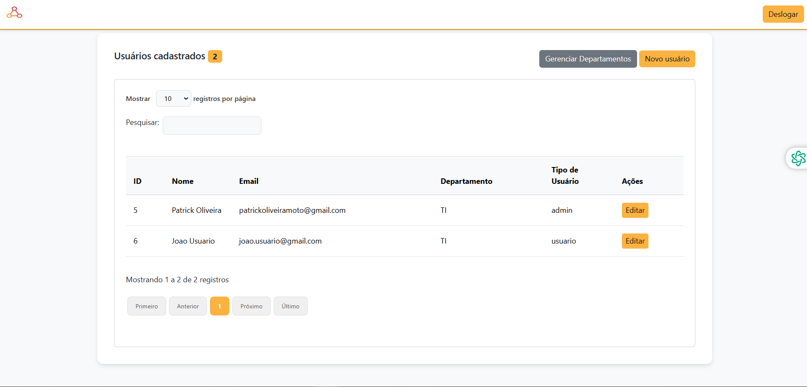

## UserHUB - Frontend (MVP Pós Graduação - PUC RIO Desenvolvimento Fullstack Básico)

## Descrição do Projeto
O frontend do UserHUB é responsável pela interface de usuário da aplicação web, permitindo a interação com o sistema de gerenciamento de usuários e departamentos. Ele oferece uma experiência diferenciada para administradores e usuários comuns através de diferentes dashboards.

## Tecnologias Utilizadas
- **HTML5**: Estrutura básica das páginas.
- **CSS3**: Estilização das interfaces.
- **JavaScript**: Interatividade e lógica de frontend.
- **Bootstrap**: Framework CSS para design responsivo.
- **jQuery**: Biblioteca JavaScript para manipulação simplificada do DOM.
- **DataTables**: Plugin jQuery para criação de tabelas dinâmicas.

## Instruções de Instalação

### Pré-requisitos
- Node.js e npm instalados no seu sistema.

### Configuração do Ambiente Local

1. Clone o repositório para sua máquina local e navegue até o diretório do frontend.
2. Instale as dependências do projeto utilizando o npm para garantir que todos os pacotes necessários estejam disponíveis.

### Comandos de Inicialização

- **Iniciar o Servidor de Desenvolvimento**: Utilize o npm para iniciar o servidor de desenvolvimento e visualizar a aplicação no navegador.
- **Build para Produção**: Prepare o aplicativo para implantação em produção, gerando uma pasta com os arquivos otimizados.

## Estrutura de Pastas

- **public/**: Contém o arquivo `index.html` principal e ativos públicos.
- **src/**: Contém o código-fonte da aplicação.
  - **components/**: Componentes reutilizáveis do React (se aplicável).
  - **styles/**: Arquivos CSS para estilização.
  - **utils/**: Funções utilitárias e helpers.
  - **App.js**: Componente principal da aplicação.

## Funcionalidades Principais
- **Autenticação de Usuário**: Login e logout de usuários.
- **Gerenciamento de Usuários**: Listagem, criação, edição e exclusão de usuários (para administradores).
- **Visualização de Dashboards**: Diferenciação de interfaces para administradores e usuários comuns.
